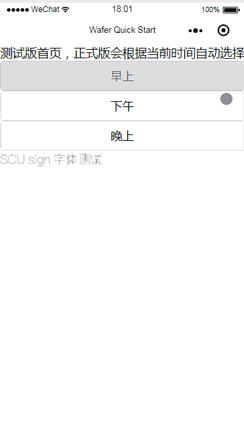
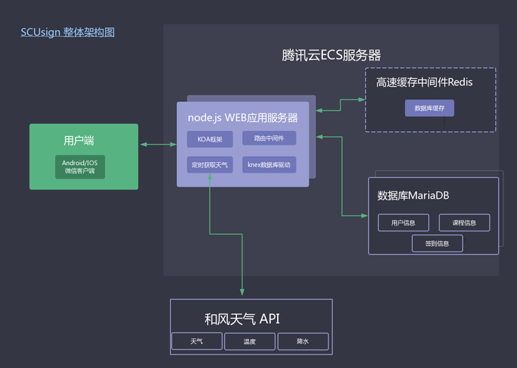
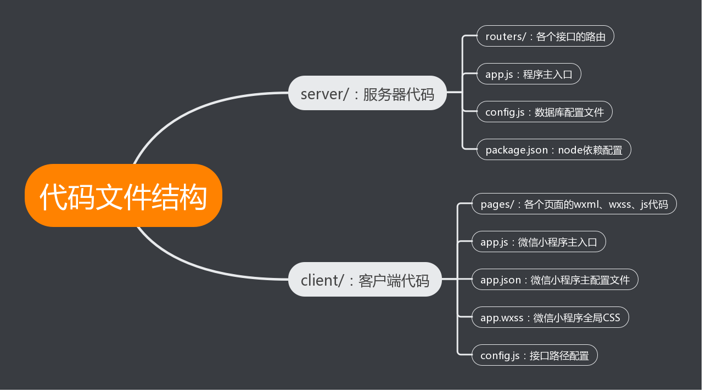

# SCUsign

这是一个用于上课签到的微信小程序，由于各个学校课程形式不同，目前仅支持四川大学。合作开发: [@viewZz](https://github.com/lvzhengyan)、[@lvzhengyan](https://github.com/viewZz)

# 预览

 
 
 

# 使用教程

## 详细使用教程请见腾讯视频链接: [https://v.qq.com/x/page/h0670hhphn7.html](https://v.qq.com/x/page/h0670hhphn7.html)

 
 

### 简化使用流程:

 
老师：注册 ---> 登录 ---> 添加一门新课程 ---> 开启签到 ---> 关闭签到 --->查看历史签到记录

 

学生：注册 ---> 登录 ---> 加入一门已存在的课程 ---> 签到 --->查看历史签到记录 

 
 
 

# 整体架构图

 
 
 

# 代码结构

 
# 关于我们

我们团队是来自四川大学 物联网工程系的3名学生，团队名： 3SM ，代表3 smart men。 团队成员分别是 [@jiladahe1997](https://github.com/jiladahe1997)、[@viewZz](https://github.com/lvzhengyan)、[@lvzhengyan](https://github.com/viewZz)。 建立团队的目的在于通过强大的web技术，用以解决校园中的实际问题；学习最新、最前沿的web技术，相互探讨学习，共同进步。

联系方式： 
mail：972931182@qq.com  
qq: 972931182 
微信: xackerb 
